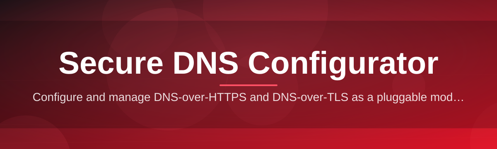

# dns-security-configurator 🔒🛰️

  

*Point-and-click DNS hardening for Windows — encrypted, filtered, and yours in under sixty seconds.*

  

---

## 📖 Overview

Every device you own quietly asks "where do I find this?" hundreds of times a day, and by default, that question — your DNS traffic — travels in plaintext to whatever resolver your ISP handed you at setup. That's a privacy leak, a censorship vector, and an open door for DNS hijacking, all bundled into a setting nobody ever looks at. **dns-security-configurator** exists because fixing that shouldn't require a networking degree, a dozen browser tabs, and forty minutes fighting the Windows adapter settings UI.

This is a solo-built, ships-fast utility for Windows 10 and 11 that turns DNS-over-HTTPS, DNS-over-TLS, and provider switching into a handful of clicks. No background services phoning home, no telemetry, no bloated installer — just a focused tool that reads your current network configuration, shows you exactly what's exposed, and lets you lock it down with encrypted resolvers from providers like Cloudflare, Quad9, and NextDNS. It's built for the person who cares about secure DNS configuration but doesn't want to become a full-time systems administrator to get it.

Whether you're a privacy-conscious home user, a small IT shop standardizing client machines, or a power user who just wants ad and malware-domain filtering without installing a browser extension graveyard, this tool was built with your exact frustration in mind. It works. It's fast. It gets out of your way.

## 🚀 Get Started

## ⚡ What It Actually Does

> [!NOTE]
> This list isn't marketing filler — every item below ships in the current build and is exercised by the automated test suite before every release.

- **Encrypted Resolver Switching** — flip your entire adapter's DNS from plaintext UDP to DNS-over-HTTPS or DNS-over-TLS with a provider picker instead of a registry edit.

- **Live Leak Detection** — a built-in probe checks whether your requests are actually going through the encrypted path or silently falling back to your ISP's resolver.

- **One-Click Rollback** — every change is snapshotted before it's applied, so reverting to your original network state is a single button, not a System Restore gamble.

- **Malware & Ad-Domain Filtering** — layer in curated blocklists at the resolver level, stopping known-bad domains before your browser even attempts a connection.

- **Multi-Adapter Awareness** — detects Ethernet, Wi-Fi, and VPN virtual adapters separately, so you're not accidentally leaving your hotspot connection unprotected.

- **Profile Presets** — save "Home," "Work," and "Public Wi-Fi" configurations and swap between them without re-entering resolver addresses each time.

- **Offline-First Design** — the app itself makes zero outbound calls beyond the DNS test you explicitly trigger; your configuration data never leaves your machine.

- **Portable Mode** — runs as a standalone executable with no installer, no registry pollution, and no leftover services if you delete it.

---

### 🧭 How To Get Rolling

1. Hit the download button above — it takes you to the official landing page, not a third-party mirror.

2. Grab the standalone `.exe`, no installer wizard, no bundled toolbars.

3. Run it. Windows may show a SmartScreen prompt for unsigned/new-publisher apps — click "More info" then "Run anyway."

4. Pick a resolver profile, hit **Apply**, and watch the leak detector confirm you're encrypted.

> [!TIP]
> First time? Start with the "Balanced" preset — it enables DoH filtering without touching advanced routing rules. You can always graduate to manual resolver entry later.

## 🖥️ System Requirements

   

| Requirement | Detail |
|---|---|
| OS | Windows 10 (64-bit) or Windows 11 |
| Dependencies | None — fully self-contained executable |
| Disk space | Under 25 MB |
| Admin rights | Required only to modify adapter DNS settings |
| Internet | Needed to fetch blocklists and run the leak test |

> [!IMPORTANT]
> Applying encrypted DNS settings requires administrator privileges because it modifies network adapter configuration. The app will never silently escalate — it always asks first.

## 🧩 How It Works

The tool operates in a simple linear pipeline every time you apply a configuration:

1. **Scan** — reads your active network adapters and their current DNS assignments.

2. **Diagnose** — flags plaintext resolvers, unusual DNS servers, or hijacked settings.

3. **Configure** — writes the chosen encrypted resolver profile to the selected adapter(s).

4. **Verify** — runs a live query through the new path and confirms encryption end-to-end.

5. **Snapshot** — stores the pre-change state so rollback is always one click away.

## 🛟 Troubleshooting

<strong>My browser still shows the old DNS provider after applying a profile.</strong>

Browsers like Firefox and Chrome sometimes cache their own DNS-over-HTTPS settings independent of Windows. Check the browser's network/security settings and either disable its built-in DoH or point it at the same resolver you configured system-wide.

<strong>The leak test says I'm "partially encrypted." What does that mean?</strong>

This usually means one adapter (often a VPN virtual adapter) is still using a plaintext fallback resolver. Open the adapter list in the app and apply the profile to every active adapter, not just your primary connection.

<strong>Windows SmartScreen is blocking the executable.</strong>

That's expected for a fast-moving indie tool without a purchased code-signing certificate yet. Click "More info" → "Run anyway." The binary is unmodified from what's published on the landing page.

<strong>Can I use this with a VPN active?</strong>

Yes, but VPNs often push their own DNS servers through the tunnel. Use the Multi-Adapter view to confirm which resolver is actually active on the VPN adapter, and apply your encrypted profile there too if needed.

<strong>Rollback isn't restoring my exact previous settings.</strong>

Rollback restores the last snapshot taken by the app. If you manually changed DNS settings outside the tool between snapshots, those manual changes won't be captured. Take a fresh snapshot before experimenting further.

## 🎨 UI, Shortcuts & Settings

> The interface leans dark by default because DNS diagnostics at 2am shouldn't require sunglasses.

| Shortcut | Action |
|---|---|
| `Ctrl + Enter` | Apply current profile |
| `Ctrl + Z` | Rollback last change |
| `Ctrl + T` | Run leak test |
| `Ctrl + ,` | Open settings |
| `F5` | Refresh adapter list |

- **Themes** — Dark (default), Light, and a high-contrast mode for accessibility.

- **Compact Mode** — collapses the adapter list into a single-line view for smaller windows.

- **Notification toggle** — silence the tray popup after a successful profile switch.

- **Auto-verify** — optionally re-runs the leak test every time Windows reconnects to a network.

## 🤝 Contributing & Community

This started as a one-person itch-scratching project, and it's grown because people kept filing genuinely useful issues instead of vague complaints. Bug reports, resolver profile suggestions, and blocklist curation pull requests are all welcome.

> [!TIP]
> Before opening an issue, run the built-in diagnostic export (`Ctrl + ,` → Export Logs) and attach it. It saves everyone a round-trip of "what does your adapter list look like."

- Found a resolver that misbehaves? Open an issue with the provider name and region.
- Want a new preset profile? PRs to the `profiles/` config are the fastest path to merge.
- Translations and blocklist curation are ongoing community efforts — check open issues tagged `help-wanted`.

## 📜 License

Released under the [MIT License](LICENSE), 2026. Do what you want with it — ship it, fork it, put it in a corporate imaging pipeline. Just don't remove the license notice.

## ⚠️ Disclaimer

This tool modifies network adapter DNS configuration on your machine. While every change is snapshotted for rollback, you are responsible for verifying your network behaves as expected after applying a profile, especially on managed or corporate devices. The developer provides this software "as is," with no warranty, and is not liable for connectivity issues, misconfigured environments, or third-party resolver downtime.

---

